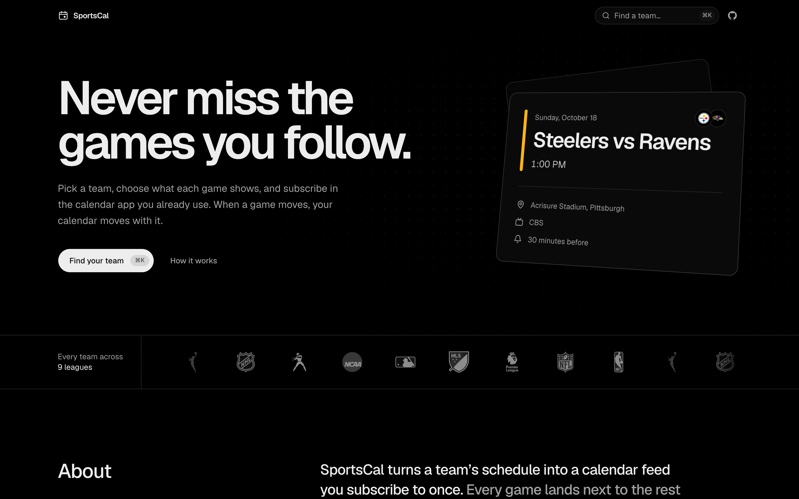

<p align="center">
  
</p>

<h1 align="center">SportsCal</h1>

<p align="center">
  Your team's schedule, in the calendar app you already use.
  <br>
  <a href="https://sportscal.site"><strong>sportscal.site</strong></a>
</p>

<p align="center">
  <a href="LICENSE"></a>
</p>

<br>



Pick a team, choose what each event shows, and subscribe. Games land in Apple Calendar, Google Calendar, Outlook, or anything else that reads iCalendar feeds, and they stay current when start times move, venues change, or playoff games are added.

Events are clean by default: a title like `Steelers vs Ravens`, the venue, and the start time. No ticket links, promotions, or ads.

## Features

- **Live subscriptions.** A feed URL that follows schedule changes, or a one-time `.ics` download.
- **Every team, nine leagues.** Search by name, school, mascot, or abbreviation.
- **Your format.** Templates for the calendar name, event title, description, and location, with a live preview.
- **Per-game edits.** Change a single game's title, details, location, or length, or hide it, without losing later schedule updates.
- **Sensible defaults.** League-specific game lengths, events marked as free time, and preseason, regular season, and postseason games that can each be turned off.
- **No duplicates.** Games with a start time to be announced appear as all-day events, then become timed events in place.
- **No account.** Saved calendars are managed with a private edit link.

## Supported leagues

| League | Coverage |
| --- | --- |
| NFL | Preseason, regular season, playoffs |
| NBA | Preseason, regular season, Play-In, playoffs |
| WNBA | Preseason, regular season (including Commissioner's Cup), playoffs |
| NHL | Preseason, regular season, playoffs |
| MLB | Spring training, regular season, postseason |
| MLS | League matches and MLS Cup playoffs |
| Premier League | Premier League matches |
| NCAA Football | Division I, grouped by conference (FBS by default, FCS on request) |
| NCAA Men's Basketball | Division I regular season and postseason, grouped by conference |

## Feeds

Every team has a default feed that works without saving anything:

```
https://sportscal.site/calendar/nfl/pittsburgh-steelers.ics
https://sportscal.site/calendar/nba/oklahoma-city-thunder.ics
https://sportscal.site/calendar/mlb/los-angeles-dodgers.ics
https://sportscal.site/calendar/ncaaf/oklahoma-sooners.ics
```

Customized calendars get their own URL, plus a private link for editing later:

```
https://sportscal.site/calendar/ncaaf/oklahoma-sooners/{id}.ics
https://sportscal.site/manage/{id}#token={secret}
```

The edit token sits in the URL fragment, so it never reaches the server.

### How updates work

Feeds are generated on request from current schedule data, so there is nothing to re-download. Each feed follows a single season and moves to the next one once it's published. Every event keeps a stable UID, so calendar apps update games in place instead of adding duplicates. How often a feed refreshes is up to your calendar app.

## Self-hosting

SportsCal ships as a Docker image for `linux/amd64` and `linux/arm64`:

```yaml
# compose.yaml
services:
  sportscal:
    image: ghcr.io/timblazing/sportscal:latest
    env_file: .env
    ports:
      - "127.0.0.1:3000:3000"
    restart: unless-stopped
```

```bash
docker compose up -d
```

The container runs database migrations on start, then serves on port `3000`. Put a reverse proxy in front for TLS and forward `X-Forwarded-For` so rate limiting sees client IPs. `GET /api/health` reports container health.

Downloads and default feeds work without a database. Saved calendars need PostgreSQL.

| Variable | Required | Description |
| --- | --- | --- |
| `APP_URL` | Yes | Public origin, e.g. `https://sportscal.site` |
| `DATABASE_URL` | For saved calendars | PostgreSQL connection string |
| `DATABASE_URL_POOLED` | No | Pooled connection for app traffic |
| `DATABASE_POOL_MAX` | No | Connections per instance (default `5`) |
| `RATE_LIMIT_MAX` | No | Saves per IP per window (default `20`) |
| `RATE_LIMIT_WINDOW_SECONDS` | No | Rate limit window (default `3600`) |
| `RATE_LIMIT_SALT` | No | Salt for hashed IPs |
| `RUN_MIGRATIONS` | No | Set to `false` to skip migrations on start |

## Development

Requires Node.js 22.13+, pnpm, and optionally PostgreSQL.

```bash
pnpm install
cp .env.example .env.local
docker compose up -d   # optional local PostgreSQL
pnpm db:migrate
pnpm dev               # http://localhost:3000
```

```bash
pnpm lint
pnpm typecheck
pnpm test
```

Built with Next.js, React, TypeScript, Tailwind CSS, shadcn/ui, Drizzle ORM, and PostgreSQL.

### Adding a league

League behavior is configured in [`lib/config/leagues.ts`](lib/config/leagues.ts). Add an entry and its key to `LEAGUE_KEYS`, then add fixtures and tests for the new league's schedule data. Search, templates, and feeds work from the shared model.

## Data

Schedules come from ESPN's public but undocumented endpoints, which can change without notice. SportsCal is not affiliated with or endorsed by ESPN or any league or team.

## License

[MIT](LICENSE)
