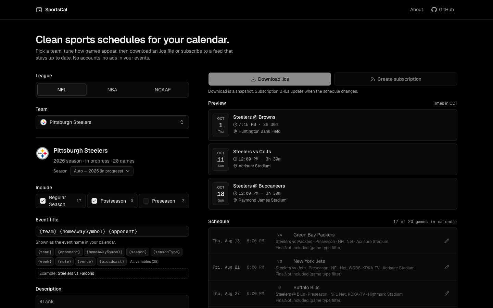

# SportsCal

Clean, customizable sports calendars. Pick a team, choose how its games appear, then download an `.ics` file or subscribe to a URL that stays up to date.

**https://sportscal.site**



By default an event is just:

| Field       | Value                                   |
| ----------- | --------------------------------------- |
| Title       | `Oklahoma vs Texas` / `Oklahoma @ Auburn` |
| Location    | The venue ESPN lists                    |
| Description | Blank                                   |

No ticket links, store links, social links or app ads. Add more with templates if you want it.

## Supported leagues

- **NFL**
- **NBA**
- **WNBA** (grouped by Eastern/Western conference; Commissioner’s Cup games are included with the regular season)
- **NHL**
- **MLS** (regular-season matches and all MLS Cup playoff rounds; other competitions excluded)
- **NCAAF** (NCAA Division I football — FBS by default, grouped by conference, with a "Show all teams" option for FCS and other divisions)
- **NCAAB** (NCAA Division I men's basketball — grouped by conference)

## Features

- Searchable team picker (name, school, mascot, abbreviation) grouped by conference/division from ESPN metadata
- Automatic season detection: the in-progress season, the upcoming season once ESPN publishes it, otherwise the latest one. NBA labels come from ESPN (`2026-27`), never from the numeric season id.
- Game types: Regular Season, Postseason, and Preseason on by default (NBA Play-In counts as postseason); individual types can be excluded in Advanced settings.
- Global templates for calendar name, event title, description and location, with a click-to-insert variable picker and live preview
- Minor per-game overrides (title, description, location, duration, include/exclude), stored as partial patches so later template changes still apply
- League-default durations: NFL/NCAAF 3h30, NBA/NHL 2h30, WNBA/MLS/NCAAB 2h, adjustable
- Events are **Free** (transparent) by default; optional Busy
- Optional ESPN link in the iCalendar `URL` field (off by default, never in the description)
- TBD kickoff times become all-day events and later turn into timed events **with the same UID**
- Canceled games stay on the calendar with `STATUS:CANCELLED`; postponed games without a new time become tentative all-day events
- Downloads (snapshot, nothing stored) and subscription feeds (regenerated from current ESPN data)
- Anonymous saved calendars with a private edit link — no accounts

## Feed URLs

Canonical feeds use the default settings and need no database record:

```
https://sportscal.site/calendar/mls/san-diego-fc.ics
https://sportscal.site/calendar/nfl/pittsburgh-steelers.ics
https://sportscal.site/calendar/nba/oklahoma-city-thunder.ics
https://sportscal.site/calendar/wnba/indiana-fever.ics
https://sportscal.site/calendar/ncaaf/oklahoma-sooners.ics
https://sportscal.site/calendar/ncaab/duke-blue-devils.ics
```

Custom feeds are saved configurations:

```
https://sportscal.site/calendar/ncaaf/oklahoma-sooners/{publicId}.ics
```

Manage a custom feed with its private link (the token lives in the URL fragment, which is never sent to the server):

```
https://sportscal.site/manage/{publicId}#token=SECRET
```

Deep links preselect the builder: `https://sportscal.site/?league=ncaaf&team=oklahoma-sooners`.

### How feeds update

Every feed request loads the configuration, resolves the current season, reads the cached ESPN schedule, applies filters, templates and overrides, and generates the calendar. Schedules are never stored, so new start times, venue and broadcast changes, and postseason games show up on their own.

Feeds always represent **one** current season: when ESPN's next season becomes the right one, the same URL switches to it. Calendar apps may keep events they already imported from the previous season; that depends on the app.

### Stable UIDs

- Canonical feed: `espn-{eventId}-{teamId}@sportscal.site`
- Custom feed: `espn-{eventId}-{publicId}@sportscal.site`

UIDs never change between refreshes, so calendar apps update events in place instead of adding duplicates.

## Stack

Next.js (App Router) · TypeScript (strict) · React · Tailwind CSS · shadcn/ui · Geist · Lucide · [`ics`](https://github.com/adamgibbons/ics) · Zod · Drizzle ORM · PostgreSQL · pnpm · Vitest · agent-browser

## Local development

Requirements: Node.js 22.13+ (24 recommended), pnpm, and a PostgreSQL database — either a hosted one (e.g. a Neon dev branch) or the local Docker one below.

```bash
pnpm install
cp .env.example .env.local   # set DATABASE_URL (and DATABASE_URL_POOLED for Neon)
docker compose up -d         # optional: local PostgreSQL on :5432 (Docker Desktop, OrbStack or Colima)
pnpm db:migrate              # apply migrations to DATABASE_URL
pnpm dev                     # http://localhost:3000
```

The root `docker-compose.yml` is only a local development database. The builder, downloads and canonical feeds work without a database; saving custom subscriptions needs PostgreSQL.

### Environment variables

| Variable                    | Required        | Description                                                              |
| --------------------------- | --------------- | ------------------------------------------------------------------------ |
| `DATABASE_URL`              | for saved feeds | PostgreSQL connection string. Used for migrations, and for the app when no pooled URL is set |
| `DATABASE_URL_POOLED`       | no              | Pooled connection for app traffic (Neon's `-pooler` host)                |
| `APP_URL`                   | yes             | Public origin, read at runtime (`https://sportscal.site` in production, `http://localhost:3000` locally) |
| `RATE_LIMIT_MAX`            | no              | Anonymous creates/updates per IP per window (default `20`)               |
| `RATE_LIMIT_WINDOW_SECONDS` | no              | Rate limit window (default `3600`)                                       |
| `RATE_LIMIT_SALT`           | no              | Salt for hashing IPs in the rate-limit table                             |
| `RUN_MIGRATIONS`            | no              | Docker only: set `false` to skip migrations on container start           |
| `DATABASE_POOL_MAX`         | no              | Max connections per server instance (default `5`)                        |

### Database

Schema lives in `lib/db/schema.ts`; migrations in `drizzle/`.

```bash
pnpm db:generate   # create a migration after changing the schema
pnpm db:migrate    # apply migrations to DATABASE_URL
pnpm db:studio     # browse data
```

Any standard PostgreSQL works (Neon, Supabase, RDS, self-hosted). The driver is [`postgres`](https://github.com/porsager/postgres) with prepared statements disabled, so transaction-mode poolers (PgBouncer) are fine.

## Tests

```bash
pnpm lint
pnpm typecheck
pnpm test        # unit/integration tests, fixture-based, no network
pnpm test:live   # optional: live ESPN checks for each supported league
```

Unit tests use small sanitized ESPN fixtures in `tests/fixtures/espn` (Pittsburgh Steelers, Oklahoma City Thunder, Oklahoma Sooners) and parse generated calendars with [ical.js](https://github.com/kewisch/ical.js) as an independent validator. For browser acceptance checks, install and set up [agent-browser](https://agent-browser.dev), start the production app with `pnpm build && pnpm start -p 3100`, then follow the [agent-browser E2E checklist](docs/testing/agent-browser-e2e.md) in another terminal. The browser workflow uses live ESPN data; checks that save subscriptions also need `DATABASE_URL` and migrated tables.

## Deployment (Docker)

SportsCal ships as a single Docker image. Every push to `main` runs `.github/workflows/docker.yml`, which builds the image for `linux/amd64` and `linux/arm64` (about 10 minutes) and publishes it to GitHub Container Registry:

```
ghcr.io/timblazing/sportscal:latest        # latest main
ghcr.io/timblazing/sportscal:sha-<commit>  # pinned build, for rollbacks
```

The package is public, so servers can pull without logging in. A separate `CI` workflow runs lint, typecheck, unit tests and a production build on every push and pull request.

### Running on a VPS

`compose.yaml` on the server:

```yaml
services:
  sportscal:
    image: ghcr.io/timblazing/sportscal:latest
    container_name: sportscal
    env_file: .env
    ports:
      - "127.0.0.1:3006:3000"   # host port is up to you; the container listens on 3000
    restart: unless-stopped
```

`.env` next to it (see `deploy/.env.example`):

```bash
DATABASE_URL=postgresql://...neon.tech/neondb?sslmode=require&channel_binding=require          # direct
DATABASE_URL_POOLED=postgresql://...-pooler...neon.tech/neondb?sslmode=require&channel_binding=require  # pooled
APP_URL=https://sportscal.site
RATE_LIMIT_SALT=any-random-string
```

```bash
docker compose pull && docker compose up -d
```

- The database is external (Neon), so no Postgres container or port is needed on the server.
- On start the container applies pending Drizzle migrations using `DATABASE_URL` (retrying while Neon wakes from scale-to-zero), then starts the Next.js standalone server on port 3000. Set `RUN_MIGRATIONS=false` to skip.
- Put a reverse proxy (Caddy, nginx, Traefik) in front for TLS on `sportscal.site`, and have it pass `X-Forwarded-For` so rate limiting sees real client IPs. Bind the host port to `127.0.0.1` when the proxy runs on the same machine.
- `GET /api/health` is the container health check.

### Updating

After a push to `main` and a finished image build, either run `docker compose pull && docker compose up -d`, or add Watchtower to update automatically — `deploy/docker-compose.yml` has a complete example with it. To roll back, pin `image:` to a `sha-<commit>` tag.

Build the image locally with `docker build -t sportscal .`.

### Caching

Feeds send `Cache-Control: public, max-age=300, s-maxage=900, stale-while-revalidate=3600`, so a caching proxy or CDN in front can absorb calendar-app polling. ESPN requests are cached in the server's data cache: team catalogs 24h, season metadata 6h, schedules 15 min (3h for completed seasons). The cache lives in the container and starts empty after a restart.

### Neon

Create a project with only **Postgres database** enabled (object storage, functions, AI gateway and Neon Auth aren't used), in the region nearest your server. Neon shows two connection strings: the direct one is `DATABASE_URL`, the `-pooler` one is `DATABASE_URL_POOLED`. The Neon CLI/agent setup isn't needed.

## Adding a league

Most of the work is one entry in `lib/config/leagues.ts`. The NHL entry is a minimal example:

```ts
nhl: {
  key: "nhl",
  sport: "hockey",
  league: "nhl",
  label: "NHL",
  name: "National Hockey League",
  defaultDurationMinutes: 150,
  scheduleSeasonTypes: [1, 2, 3],
  seasonTypeFallback: { "1": "preseason", "2": "regular", "3": "postseason", "4": "other" },
  teamGrouping: { kind: "groups" },
  scheduleTimeZone: "America/New_York",
  hasWeeks: false,
},
```

Add the key to `LEAGUE_KEYS`, check the ESPN responses for that league (season types, groups), add fixtures and tests. Templates, feeds, the picker and the season resolver work from the normalized model.

## Architecture

```
lib/
  config/leagues.ts      league registry (all league-specific behavior)
  espn/                  the only code that knows ESPN's JSON
    client.ts            URL building from the registry, fetch + caching, last-good fallback
    schemas.ts           defensive Zod schemas
    normalize.ts         normalizeTeam / normalizeGame / normalizeSeason / normalizeBroadcasts / normalizeVenue
    teams.ts seasons.ts schedules.ts
  calendar/              templates, filters, overrides, UIDs, events, ICS generator, feed pipeline
  db/                    Drizzle schema, client, saved-calendar repository
  security/              edit tokens (hashed, constant-time compare), rate limiting
  validation/            calendar config schema, limits, defaults
scripts/migrate.ts       migration runner bundled into the Docker image
app/
  api/{leagues,teams,schedule,download,calendars,health}
  calendar/[league]/[...path]   .ics feeds
  manage/[publicId]             edit a saved calendar
components/{builder,schedule,subscription,layout,ui}
Dockerfile, docker-entrypoint.sh   production image (migrate, then serve)
deploy/                  example VPS compose file and .env
.github/workflows/       ci.yml (checks), docker.yml (image on push to main)
```

## ESPN data disclaimer

Schedule data comes from ESPN's public but undocumented API endpoints. They can change without notice; SportsCal isolates every assumption in `lib/espn` and degrades gracefully when optional fields are missing. SportsCal is not affiliated with or endorsed by ESPN or the leagues and teams listed.

## License

[MIT](LICENSE)
